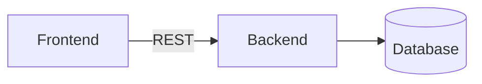

# project-template

## Context
<!-- What is this project and why does it exist? Business goal in 2-3 sentences. -->

## Architecture
<!-- High-level: stack, key components, main constraints. -->

<!-- Mermaid diagram placeholder -->

## Requirements
<!-- What the product must do. Keep it current — edit in place when things change. -->

## Tasks
<!-- Active tasks only. Completed tasks get deleted, not archived. -->
- [ ] 

## Improvements
<!-- Ideas, refactors, or tech debt worth tracking — but not active tasks yet.
     Move to Tasks when prioritized, delete when no longer relevant. -->

## People
<!-- Name — role — contact -->

## Open questions
<!-- Unresolved decisions or things to clarify. Remove when resolved. -->

## Improvements
<!-- Future improvements to be implemented. -->