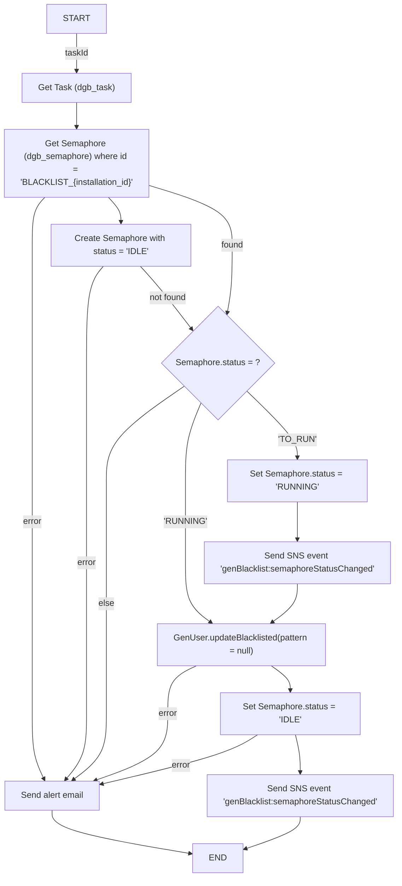
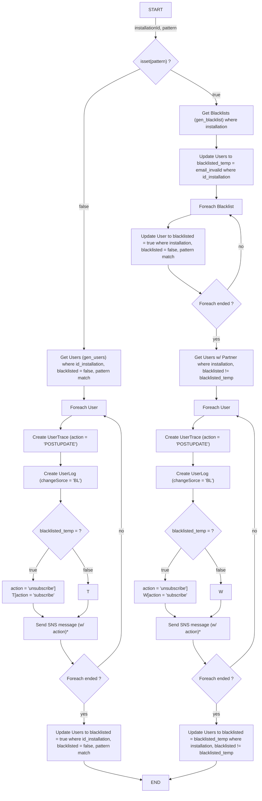
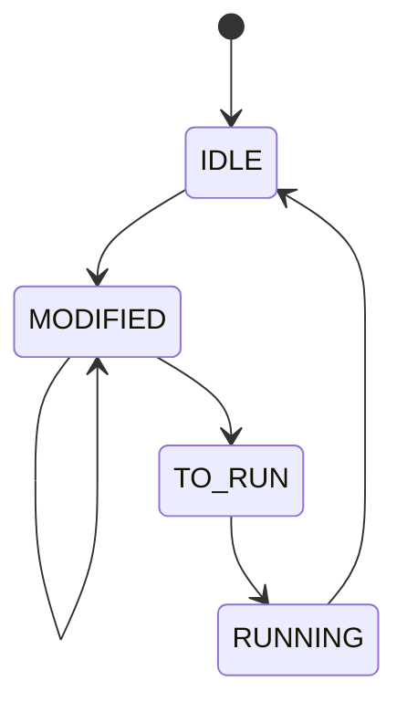
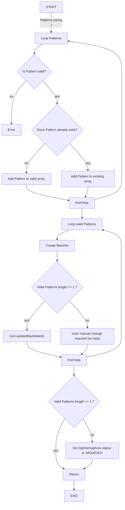

---

### GenTaskApplyBlacklistsChanges

```mermaid
flowchart TD
	START
	A["Get Task (dgb_task)"]
	B["Get Semaphore (dgb_semaphore) where id = 'BLACKLIST_{installation_id}'"]
	C["Create Semaphore with status = 'IDLE'"]
	D{"Semaphore.status = ?"}
	E["Set Semaphore.status = 'RUNNING'"]
	F["Send SNS event 'genBlacklist:semaphoreStatusChanged'"]
	G["GenUser.updateBlacklisted(pattern = null)"]
	H["Set Semaphore.status = 'IDLE'"]
	I["Send SNS event 'genBlacklist:semaphoreStatusChanged'"]
	SEND_ALERT_EMAIL["Send alert email"]
	END
	
	START -->|taskId| A
    A --> B
    B --> C
	C -->|not found| D
    B -->|found| D
    B -->|error| SEND_ALERT_EMAIL
    C -->|error| SEND_ALERT_EMAIL
    D -->|'TO_RUN'| E
    D -->|'RUNNING'| G
    D -->|else| SEND_ALERT_EMAIL
    E --> F
    F --> G
    G -->|error| SEND_ALERT_EMAIL
    G --> H
    H -->|error| SEND_ALERT_EMAIL
    H --> I
	SEND_ALERT_EMAIL --> END
    I --> END
```

---

### GenUser.updateBlacklisted

```mermaid
flowchart TD
	START
	A{"isset(pattern) ?"}
	B["Get Users (gen_users) where id_installation, blacklisted = false, pattern match"]
	C["Foreach User"]
	D["Create UserTrace (action = 'POSTUPDATE')"]
	E["Create UserLog (changeSorce = 'BL')"]
	R{"blacklisted_temp = ?"}
	S["action = 'unsubscribe']
	T["action = 'subscribe']
	F["Send SNS message (w/ action)*"]
	G{"Foreach ended ?"}
	H["Update Users to blacklisted = true where id_installation, blacklisted = false, pattern match"]
	I["Get Blacklists (gen_blacklist) where installation"]
	L["Update Users to blacklisted_temp = email_invalid where id_installation"]
	M["Foreach Blacklist"]
	N["Update User to blacklisted = true where installation, blacklisted = false, pattern match"]
	O{"Foreach ended ?"}
	P["Get Users w/ Partner where installation, blacklisted != blacklisted_temp"]
	Q["Foreach User"]
	U["Create UserTrace (action = 'POSTUPDATE')"]
	V["Create UserLog (changeSorce = 'BL')"]
	X{"blacklisted_temp = ?"}
	Y["action = 'unsubscribe']
	W["action = 'subscribe']
	K["Send SNS message (w/ action)*"]
	Z{"Foreach ended ?"}
	AA["Update Users to blacklisted = blacklisted_temp where installation, blacklisted != blacklisted_temp"]
	END
	
	START -->|installationId, pattern| A
	A -->|false| B
	A -->|true| I
	B --> C
	C --> D
	D --> E
	E --> R
	F --> G
	G -->|no| C
	G -->|yes| H
	H --> END
	I --> L
	L --> M
	M --> N
	N --> O
	O -->|no| M
	O -->|yes| P
	P --> Q
	R -->|true| S
	R -->|false| T
	S --> F
	T --> F
	Q --> U
	U --> V
	V --> X
	X -->|true| Y
	X -->|false| W
	Y --> K
	W --> K
	K --> Z
	Z -->|no| Q
	Z -->|yes| AA
	AA --> END
```

---

### DgbSemaphore.setStatus

```mermaid
stateDiagram-v2
	[*] --> IDLE
    IDLE --> MODIFIED
    MODIFIED --> MODIFIED
    MODIFIED --> TO_RUN
    TO_RUN --> RUNNING
    RUNNING --> IDLE
```

---

### GenBlacklistController.create

```mermaid
flowchart TD
	START
	A[Loop Patterns]
	B{Is Pattern valid?}
	C[Error]
	D{Does Pattern already exist?}
	E[Add Pattern to valid array]
	F[Add Pattern to existing array]
	G[End loop]
	H[Loop valid Patterns]
	I[Create Blacklist]
	L{Valid Patterns length == 1 ?}
	M["Gen.updateBlacklisted()"]
	N["User manual change required (w/ task)"]
	O[End loop]
	P{Valid Patterns length == 1 ?}
	Q[Return]
	R["Set DgbSemaphore status to 'MODIFIED'"]
	
	START -->|"Patterns (string \n)"| A
	A --> B
	B -->|no| C
	B -->|yes| D
	D -->|no| E
	D -->|yes| F
	E --> G
	F --> G
	G --> A
	G --> H
	H --> I
	I --> L
	L -->|yes| M
	L -->|no| N
	M --> O
	N --> O
	O --> H
	O --> P
	P -->|yes| Q
	P -->|no| R
	R --> Q
	Q --> END

```

---