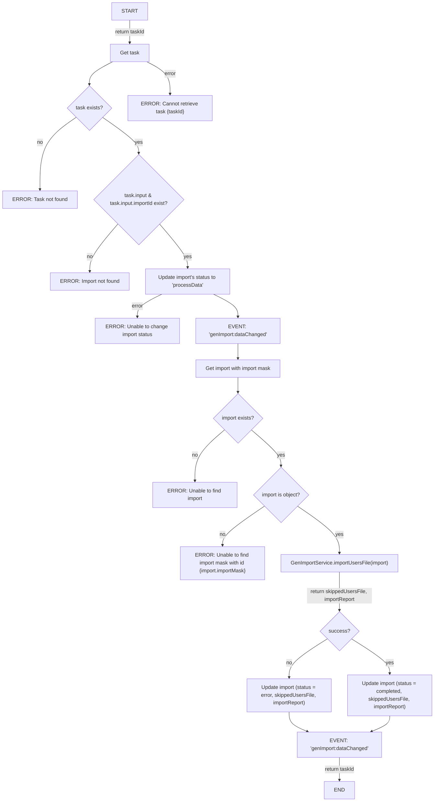
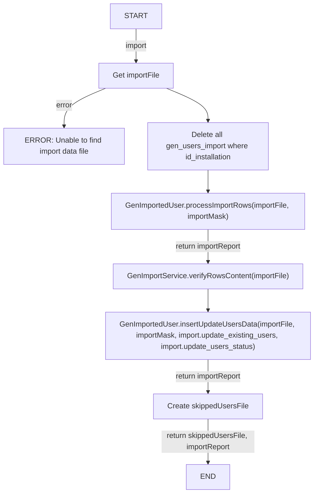
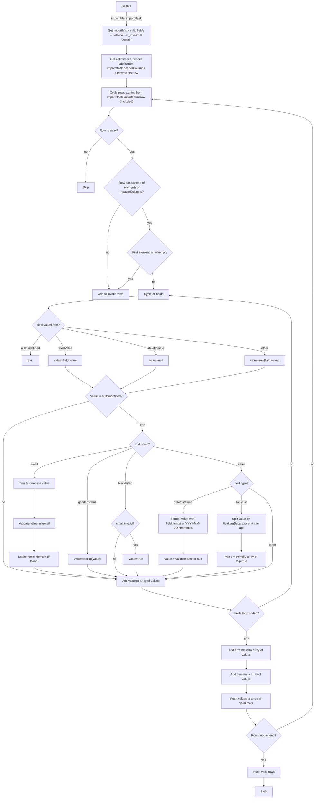
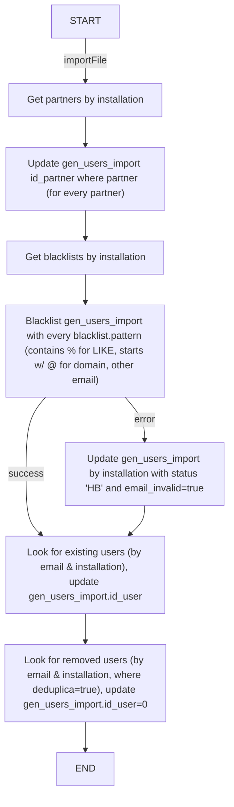
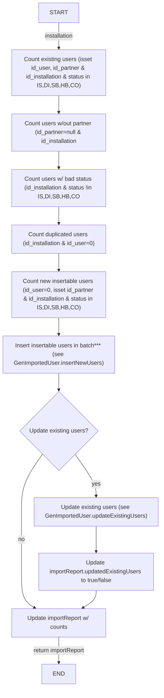
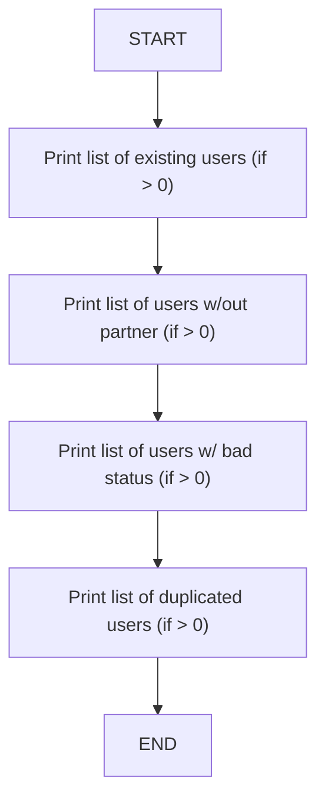
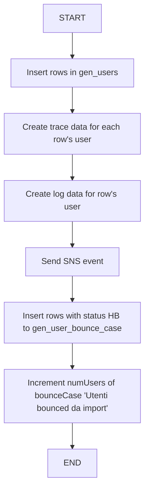
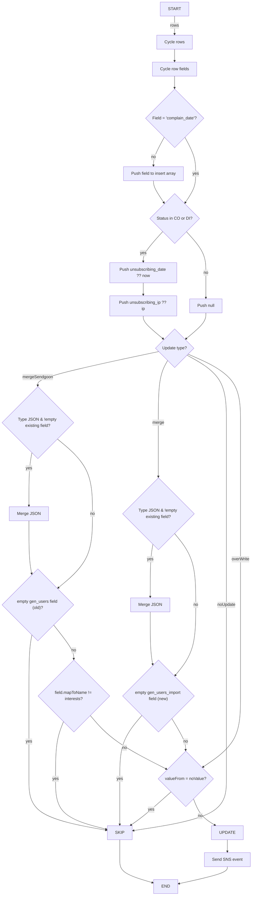
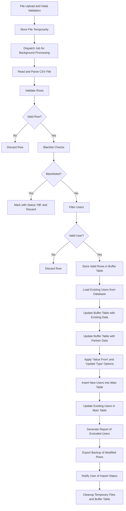
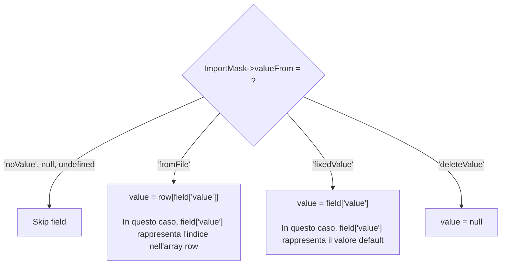

---

---

### GenTaskUsersImport

---

### GenImportService.importUsersFile

---

### GenImportService.processImportRows

---

### GenImportService.verifyRowsContent

---

### GenImportService.insertUpdateUsersData

---

### GenImportService.writeSkippedUsersData

---

### GenImportedUser.insertNewUsers

---

### GenImportedUser.updateExistingUsers

---

#### Value From:
- **noValue**: ignore file column
- **fromFile**: get value from file
- **fixedValue**: default value
- **deleteValue**: set as null

#### Update Type:
- **Merge**: merge type JSON and overwrite other ones (unless new value is null)
- **Merge Sendgoon**: merge if type JSON and overwrite other ones (unless current value is not null and column label != 'interests')
- **Overwrite**
- **Don't update**

Hanno senso le opzioni updateTypes per noValue?

---

---

