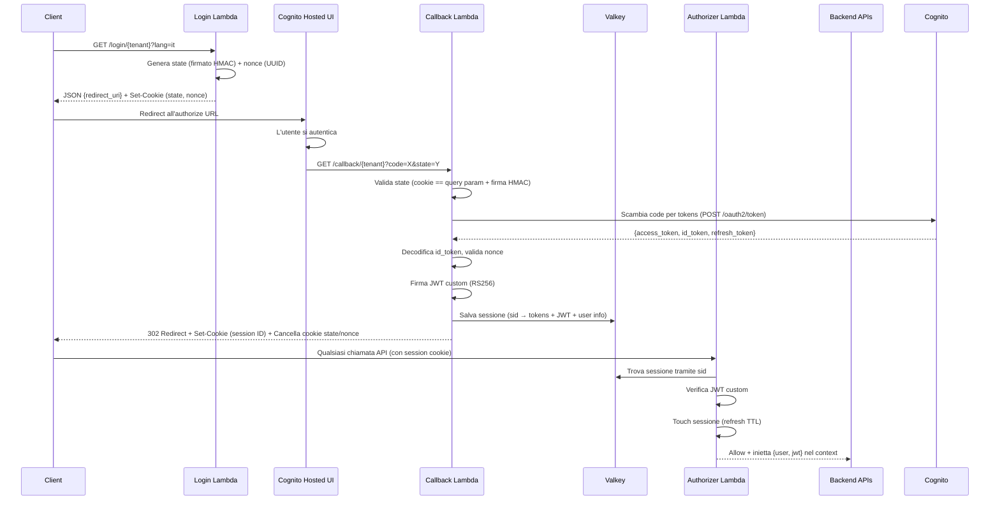

# Authentication Flow — Panoramica Architetturale

  

## Overview

  

Sistema di autenticazione serverless basato su **OAuth2/OIDC Authorization Code Flow**, costruito con AWS Lambda + API Gateway. L'Identity Provider è **AWS Cognito** (un User Pool per ogni tenant). Le sessioni sono memorizzate in **Valkey** (compatibile Redis), i dati operatore in **MariaDB**.

  

---

  

## Flusso Completo

  



  

---

  

## Ruolo di ogni Lambda

  

| Funzione | Route | Scopo |

|----------|-------|-------|

| **login** | `GET /login/{tenant}` | Avvia il flusso OAuth2. Genera `state` e `nonce`, li imposta come cookie, restituisce l'URL di autorizzazione Cognito |

| **callback** | `GET /callback/{tenant}` | Gestisce il ritorno da Cognito. Valida state/nonce, scambia il code per i token, crea la sessione in Valkey, imposta il session cookie |

| **authorizer** | Lambda Authorizer (interna) | Protegge ogni endpoint. Legge il session cookie, recupera la sessione da Valkey, verifica il JWT, restituisce la policy IAM Allow/Deny |

| **logout** | `GET /logout/{installationId}` | Cancella la sessione da Valkey, elimina il session cookie, redirige alla logout URL di Cognito |

| **me** | `GET /me` | Restituisce le informazioni dell'utente corrente (dalla sessione + tabella operatori nel DB) |

| **change-password** | `POST /change-password` | Cambia la password Cognito dell'utente usando l'access_token salvato, aggiorna la scadenza password |

| **expire-passwords** | Cron giornaliero (scheduled) | Scansiona tutti gli User Pool dei tenant per password scadute, le resetta e invia email di notifica via SES |

| **hello** | `POST /hello` | Health-check / funzione di esempio |

  

---

  

## State

  

### Cos'è

  

Un payload JSON firmato e codificato in base64url, nel formato:

  

```

<base64url({lang, uuid})>.<hmac_sha256_signature>

```

  

### A cosa serve

  

**Protezione CSRF**. Garantisce che il callback provenga da una richiesta di login legittima avviata dall'utente.

  

### Come funziona

  

1. La Lambda `login` genera lo state, lo firma con `STATE_SECRET` (HMAC-SHA256)

2. Lo state viene salvato come cookie E incluso nell'URL di autorizzazione Cognito (query param)

3. La Lambda `callback` verifica che:

   - Il valore nel cookie == il valore nel query parameter

   - La firma HMAC sia valida (integrità, non è stato manipolato)

  

---

  

## Nonce

  

### Cos'è

  

Un UUID crittograficamente random generato con `crypto.randomUUID()`.

  

### A cosa serve

  

**Protezione da replay attack**. Garantisce che l'`id_token` ricevuto sia stato emesso specificamente per questa richiesta di autenticazione e non sia un token riutilizzato.

  

### Come funziona

  

1. La Lambda `login` genera il nonce, lo salva come cookie e lo include nell'authorize URL

2. Cognito incorpora il nonce nel payload dell'`id_token`

3. La Lambda `callback` verifica che il nonce decodificato dall'`id_token` == il nonce nel cookie

  

---

  

## Cookie

  

| Nome Cookie | Esempio | Scopo | Attributi |

|-------------|---------|-------|-----------|

| `{STAGE}_oauth_state` | `staging_oauth_state` | Conserva lo state firmato durante il flusso di login | `HttpOnly`, `Secure` (prod), `SameSite=Lax`, `Path=/`, `Domain={COOKIE_DOMAIN}`, `Max-Age=900` (15 min) |

| `{STAGE}_oauth_nonce` | `staging_oauth_nonce` | Conserva il nonce durante il flusso di login | Stessi attributi dello state |

| `{STAGE}_sid` | `staging_sid` | Identificativo sessione (UUID) per utenti autenticati | `HttpOnly`, `Secure` (prod), `SameSite=Lax`, `Path=/`, `Domain={COOKIE_DOMAIN}`, **senza Max-Age** (session cookie) |

  

### Ciclo di vita

  

- **Login**: vengono impostati `state` e `nonce` (durata 15 minuti)

- **Callback**: `state` e `nonce` vengono **cancellati** (Max-Age=0), il cookie `sid` viene **creato**

- **Logout**: il cookie `sid` viene **cancellato** (Max-Age=0)

  

### Sicurezza

  

- `HttpOnly` → non accessibili da JavaScript (protezione XSS)

- `Secure` → trasmessi solo su HTTPS (in produzione)

- `SameSite=Lax` → protezione CSRF base (il cookie viene inviato solo per navigazioni top-level)

  

---

  

## Sessione

  

### Storage: Valkey (Redis-compatible)

  

Le sessioni sono salvate come **hash Redis** con chiave `sessions:{uuid}`.

  

### Struttura della sessione

  

```json

{

  "sid": "uuid-della-sessione",

  "cognito_user_id": "cognito-sub",

  "sendgoon_user_id": 123,

  "tenant": "system",

  "installation_id": 1,

  "cognito_tokens": {

    "access_token": "...",

    "id_token": "...",

    "refresh_token": "...",

    "expires_in": 3600,

    "token_type": "Bearer"

  },

  "jwt": "eyJhbGciOiJSUzI1NiJ9..."

}

```

  

### TTL e Sliding Expiration

  

- Le sessioni scadono dopo **24 ore** (`CACHE_EXPIRY_SECONDS = 86400`)

- Ogni richiesta autenticata che passa per l'authorizer **rinnova il TTL** (sliding expiration)

- Eccezione: le **no-touch routes** (polling, health-check) non rinnovano il TTL per evitare di mantenere vive sessioni inattive

  

---

  

## Authorizer — Logica di Validazione

  

1. Estrae il cookie `{STAGE}_sid` dagli header della richiesta

2. Cerca la sessione in Valkey tramite il session ID

3. Verifica il JWT custom salvato nella sessione (RS256, chiave pubblica da AWS Secrets Manager)

4. Controlla se il path della richiesta è una "no-touch route"

   - **Se no**: rinnova il TTL della sessione (sliding expiration)

   - **Se sì**: non tocca il TTL

5. Restituisce una policy IAM **Allow** con `context.user` (user ID) e `context.jwt` (Bearer token) iniettati per le Lambda a valle

  

Se un qualsiasi passaggio fallisce → restituisce una policy **Deny**.

  

---

  

## Token

  

### Token Cognito (dal code exchange OAuth2)

  

| Token | Uso |

|-------|-----|

| `access_token` | Chiamate alle API Cognito (es. change-password) |

| `id_token` | Contiene i claims utente (`sub`, `custom:id_user_sg`, `nonce`) |

| `refresh_token` | Salvato nella sessione per eventuale refresh futuro |

  

### JWT Custom (RS256)

  

- **Firmato con**: chiave privata RSA da AWS Secrets Manager

- **Verificato con**: chiave pubblica RSA da AWS Secrets Manager

- **Payload**: `{sub: sendgoon_user_id, installation_id_sg, lang}`

- **Scadenza**: 24 ore

- **Scopo**: passato ai servizi downstream come Bearer token tramite il context dell'authorizer

  

---

  

## Multi-Tenancy

  

Ogni tenant ha:

  

- Il proprio **Cognito User Pool** con dominio dedicato

- `client_id` e `client_secret` univoci

- `redirect_uri` e `logout_redirect_uri` specifici

- Un `installation_id` che lo collega al DB interno

- Una durata configurabile per la scadenza password (`password_duration_days`)

  

### Sorgenti di configurazione (in ordine di priorità)

  

1. **Database** (modalità `DB`, default) — tabella `dgb_installation`, con cache in Valkey (600s)

2. **JSON statico** (modalità `STATIC`) — da variabile d'ambiente `TENANT_CONFIG_JSON` o file `TENANT_CONFIG_FILE`

  

Le route sono scoped per tenant: `/login/{tenant}`, `/callback/{tenant}`, dove `{tenant}` è la chiave nella mappa di configurazione (es. `"system"`, `"reklame"`).